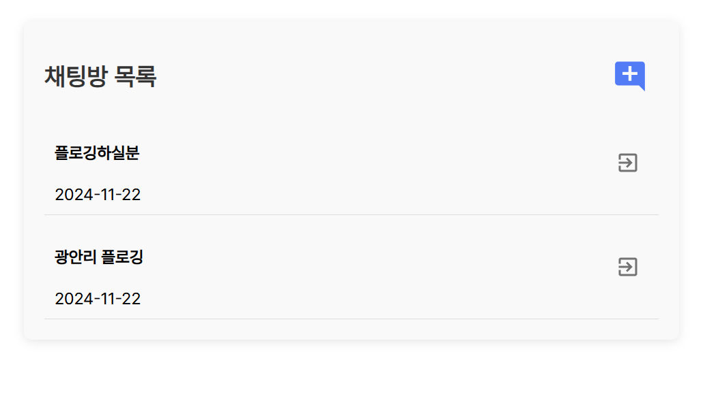

<a href="https://club-project-one.vercel.app/" target="_blank">

</a>


# 1. Project Overview (프로젝트 개요)
- 프로젝트 이름: PLOGGER
- 프로젝트 설명: 플로깅 활동 모집 커뮤니티
- 프로젝트 기간: 24.10.01 - 24.11.20

<br/>
<br/>

# 2. Team Members (팀원 및 팀 소개)
| 이병준 | 김세연 | 김기정 | 정승아 | 장채원 |
|:------:|:------:|:------:|:------:|:------:|
|  |  |  |  |
| [GitHub](https://github.com/imwkdrh) | [GitHub](https://github.com/workmakerdaily) | [GitHub](https://github.com/ki-jung) | [GitHub](https://github.com/Jeongsunga) | [GitHub](https://github.com/mikieoo) |

<br/>
<br/>

# 3. Key Features (페이지별 주요 기능)
- **회원가입**:
  - 사용자의 아이디가 중복되었는지 확인할 수 있다.
  - 비밀번호가 정규식에 맞는지 체크할 수 있다.
  - 전화번호 중복 확인 및 인증번호 발송을 통해 안전하게 인증할 수 있다.
  - 다음 API를 이용해 사용자의 주소를 검색할 수 있다.

- **로그인**:
  - Oauth 이미지를 클릭하면 네이버, 카카오, 구글을 통해 로그인이 가능하다.
  - 아이디 찾기: 
    - 전화번호로 일치하는 사용자를 확인하고, 인증번호를 전송해 본인 확인 후 아이디를 찾을 수 있다.
  - 비밀번호 찾기: 
    - 아이디와 전화번호가 모두 일치하는 사용자가 있을 경우, 인증번호를 전송해 본인 확인 후 동일한 전화번호로 임시 비밀번호를 받을 수 있다.

- **네비게이션**:
  - 네비게이션 및 검색 기능:
    - 구인 게시판, 활동 게시판, Q&A 게시판에서만 네비게이션 내 검색창이 표시된다.
    - 검색어 입력 시 게시글 번호, 제목, 작성자로 필터링된 목록이 보여진다.
    - 네비게이션 바는 상단에 고정되어 페이지 이동 시에도 유지되지만, 특정 페이지(회원가입, 개인정보 수정 등)에서는 숨겨지며, 검색 기능이 필요하지 않은 페이지에서는 검색창이 표시되지 않도록 하였다.
    - 스크롤 시 네비게이션 바가 반투명 상태가 되도록 설정하였다.
  - 이동 및 디자인:
    - 게시판 이름을 클릭하면 해당 게시판으로 이동하며, 로고 클릭 시 메인 페이지로 이동하도록 설정하였다.
    - 로그인 상태에 따라 버튼이 동적으로 변하며, 로그인되지 않은 경우 우측에 로그인 및 회원가입 버튼이 표시된다. 로그인 후에는 내 프로필 사진, 알람, 로그아웃 버튼이 표시된다.
    - 프로필 클릭 시 마이페이지로 이동하도록 설정하였다.
  - 알람 기능:
    - 알람은 팔로잉, 댓글, 좋아요, 참가 신청, 모집 종료 시 발생하며, 데이터베이스에 저장된 알람이 10초마다 사용자에게 표시되도록 설정하였다.
    - 새로운 알람이 발생하면 즉시 표시되며, 알람 클릭 시 해당 위치로 이동할 수 있다.
  - 채팅 버튼:
    - 화면 우측 하단에 채팅 버튼을 배치해 네비게이션 바가 표시되는 화면에서 함께 보이도록 설정하였다.

- **메인 페이지**:
  - 크게 다섯 가지 영역으로 구분하였다.
  - 첫 번째 영역:
    - 플로깅과 관련된 두 가지 영상이 랜덤하게 재생되도록 설정하였다.
  - 두 번째 영역:
    - 플로깅의 정의를 적어 플로깅이라는 단어가 낯선 사람들의 이해를 돕고자 하였다.
    - 글자에 움직임을 추가하여 스크롤 시 애니메이션 효과가 발생하도록 설정하였다.
  - 세 번째 영역:
    - 플로깅의 장점을 설명하며, 각 영역에 마우스를 올릴 경우 배경사진이 어두워지고 영역이 가로로 확장되며 글자가 더 잘 보이도록 하였다.
  - 네 번째 영역:
    - 웹 이용 방법을 왼쪽에 설명하였으며, 해당 설명은 마우스 휠로 스크롤하며 확인할 수 있도록 설정하였다.
    - 오른쪽에는 구인 게시판의 모집 주소에서 시·도를 불러와 활성도를 카운트하고 표시하였다.
    - 활성도는 게시글 수에 따라 차등 표시되도록 설정하였다.
  - 다섯 번째 영역:
    - 슬라이드를 통해 사진을 볼 수 있도록 설정하였다.
    - 상단 슬라이드에는 구인 게시판의 최신 게시글 사진을, 하단 슬라이드에는 활동 게시판의 최신 게시글 사진을 불러오도록 구성하였다.

- **게시판 공통**:
  - 좋아요 및 스크랩 버튼 클릭 시 즉시 색상이 변경되며, 새로고침 후에도 상태가 유지된다.
  - 좋아요 클릭 시 게시글의 좋아요 수가 1씩 증가한다.
  - 로그인하지 않은 경우, 좋아요와 스크랩 버튼은 표시되지 않는다.
  - 로그인한 사용자만 댓글 작성, 수정, 삭제가 가능하다.
  - 로그인한 사용자만 글 작성, 수정, 삭제가 가능하다.

- **구인 게시판**:
  - 지도 아래에 화살표를 표시해 스크롤을 내려볼 수 있도록 유도하며, 스크롤 시 게시글 목록이 나타나도록 설정했다.
  - 게시글 목록에서 모집 종료일까지 남은 일자에 따라 표시:
    - D-day부터 D-5까지는 빨간색
    - 그 이상의 기간은 초록색
    - 모집 종료된 경우 회색
  - 모집 상태:
    - 모집 중인 글은 검정색
    - 마감된 글은 회색으로 표시
  - 권한에 따른 접근 제한: 미인증 유저, 인증 유저, 관리자 3가지 상태로 분류했다.
  - 페이지는 두 영역(카카오맵, 게시판)으로 나뉘며 스크롤로 이동 가능하다.
  - 카카오맵:
    - 모집 중인 글의 위치를 표시하고, 마커 클릭 시 해당 글로 이동한다.
  - 게시판:
    - 글 번호, 마감 유무, 제목, 작성자, 추천 수, 조회 수, 모집 인원, 모집 상태, 작성 날짜를 표시한다.
    - 제목 클릭 시 상세 보기로 이동힌다.
    - 마감 유무 필터링 가능하다.
    - 작성자, 내용, 제목 검색 필터링 가능하다.
  - 글 작성:
    - 필수 입력 항목: 제목, 내용, 모집 인원, 마감일자, 모집 장소.
    - 이미지 첨부 가능하다.
    - 글 등록 시 작성일자는 현재 시간으로 입력된다.
    - 마감일 도래 시 모집 상태가 자동으로 "마감"으로 변경된다.
  - 기타 기능:
    - 조회 시마다 조회 수 1씩 증가한다.
    - Geolocation으로 접속자의 현재 위치 중심으로 모집 장소 지정 가능하다.
    - 모집 장소의 위경도를 통해 주소로 변환한다.
    - 모집 상태와 참가자 목록이 표시된다.
    - 참가자 리스트를 통해 모집 인원 확인할 수 있다.

- **활동 게시판**:
  -  작성자, 내용, 제목을 포함한 검색어를 통해 게시글을 필터링할 수 있다.
  - 자신이 작성한 구인 게시글을 선택하여 해당 구인 게시글의 참여 인원과 활동 위치를 불러올 수 있다.
  - 구인 게시글에 참여하지 않은 인원이나 마감 후 참여한 인원들을 사용자 아이디로 검색하여 추가하거나 삭제할 수 있다.
  - 사용자가 게시글을 클릭할 때마다 조회수가 1씩 증가한다.
  - 태그된 사용자들의 정보를 확인하고, 사용자의 프로필을 클릭하면 해당 사용자의 마이페이지로 이동할 수 있다.

- **Q&A 게시판**:
  - Q&A 게시판에 작성된 글 목록을 조회할 수 있다.
  - 전체, 공지, Q&A 글을 필터링하여 조회할 수 있다.
  - 제목과 내용은 필수로 입력해야 한다.
  - 댓글은 관리자만 작성할 수 있다. 관리자를 제외한 사용자의 댓글 작성란에는 "관리자만 댓글 작성이 가능합니다."라는 문구가 표시된다.
  - 댓글 수정은 관리자만 할 수 있다.
  - 모든 사용자가 댓글을 조회할 수 있다.
  - 관리자가 글을 상단에 고정할 수 있다.
  - 사용자 본인이 작성한 글은 수정하거나 삭제할 수 있다. 관리자는 사용자가 작성한 글을 임의로 수정하거나 삭제할 수 있다.
  - 비로그인 시 게시글 리스트와 글 내용 조회만 가능하다.
  - 관리자가 아니면 다른 사용자의 게시글은 수정하거나 삭제할 수 없다.

- **마이페이지**:
  - 로그인하지 않은 사용자는 마이페이지에 접근할 수 없다.
  - 마이페이지에서 해당 사용자의 정보를 가져온다. (이름, 주소, 한 줄 소개, 마일리지 수)
  - 버튼 상태:
    - 자신의 마이페이지일 경우 기프티콘 바로가기 버튼이 활성화된다.
    - 타인의 마이페이지일 경우 팔로잉 버튼이 표시되며, 버튼 클릭 시 즉시 반영되도록 설정하였다.
  - 팔로우/팔로잉 기능:
    - 계정의 팔로우 및 팔로잉 숫자가 표시되며, 해당 영역 클릭 시 목록 창이 나타나도록 하였다.
    - 목록에서 사용자를 클릭하면 해당 사용자의 마이페이지로 이동할 수 있다.
  - 게시글 및 내역 확인:
    - 사용자가 작성한 구인 게시글, 활동 게시글, 스크랩한 게시글 목록을 제공하며, 클릭 시 해당 글로 이동할 수 있다.
    - 구인/활동 게시글은 본인이 작성한 글, 스크랩 글은 본인이 저장한 글들로 목록을 구성하였다.
    - 활동 게시판 작성, 태그된 경우의 마일리지 적립 내역과 마일리지 취소 또는 기프티콘 구매 시 차감 내역을 확인할 수 있다.
    - 자신의 마이페이지가 아닌 경우 마일리지 내역과 스크랩 글은 표시되지 않는다.
  - 디자인 및 배치:
    - 프로필 이미지, 이름, 주소, 한 줄 소개는 좌측 상단에, 우측에는 팔로우/팔로잉 숫자, 마일리지, 기프티콘 바로가기 버튼이 표시된다.
    - 이름 우측의 설정 버튼을 통해 개인정보 수정 페이지로 이동할 수 있다.
  - 코멘트 수정:
    - 코멘트 수정 시 입력창이 나타나며, Enter 키 입력으로 저장되도록 하였다.
  - 기프티콘 이동:
    - 기프티콘 바로가기 버튼 클릭 시 기프티콘 페이지로 이동하도록 설정하였다.

- **유저 정보 변경**:
  - 사용자의 프로필 이미지, 이름, 비밀번호, 전화번호, 주소를 수정할 수 있다.
  - 전화번호 수정 시 인증번호를 이용해 인증을 거쳐야만 전화번호 수정을 할 수 있다.
  - 비밀번호 수정 시, 현재 비밀번호와 수정할 비밀번호를 입력하고 인증을 거쳐야만 비밀번호를 안전하게 수정할 수 있다.

- **기프티콘 페이지**:
  - 로그인된 유저는 보유한 마일리지를 확인할 수 있으며, 아이템을 클릭한 후 구매 버튼을 누르면 기프티콘을 구매할 수 있다.
  - 보유한 마일리지보다 높은 가격의 기프티콘은 구매할 수 없다.
  - 기프티콘을 구매하면 새로고침 없이 마일리지가 차감되어 표시된다.
  - 관리자 계정인 유저는 기프티콘 등록 버튼을 볼 수 있으며, 교환권 이름, 가격, 이미지를 입력하여 기프티콘을 추가할 수 있다.
  - 이미지가 없을 경우 기본 이미지가 자동으로 입력된다.
  - 관리자 계정의 유저는 아이템을 클릭하면 해당 기프티콘의 정보가 뜨며, 수정 및 삭제가 가능하다.
  - 교환권 이름, 가격, 이미지 중 하나 이상을 입력해야 수정이 가능하다.

- **채팅 페이지**:
  - 자신의 채팅방 목록에 있는 채팅방에만 참여할 수 있다.
  - 채팅방을 생성할 수 있다.
  - 채팅방에 있는 메시지들은 영구적으로 저장된다.
  - 자신이 초대하고 싶은 사용자를 검색하여 초대할 수 있다.
  - 초대 리스트에는 현재 채팅방에 참여한 인원들이 보이지 않게 필터링된다.
  - 자신이 읽지 않은 메시지가 있으면, 그 수만큼 숫자가 채팅방 목록에 표시된다.
  - 유저는 삭제하거나 나가고 싶은 채팅방에서 나갈 수 있다.

- **관리자 페이지**:
  - 사용자가 신고한 내역과 사이트에 가입한 사용자의 가입 정보를 조회할 수 있다.
  - 신고 내역을 클릭하면 신고된 게시글의 상세페이지로 이동하며, 글 삭제 처리를 할 수 있다.
  - 신고를 처리한 게시글의 신고 내역은 삭제할 수 있다.
  - 신고받은 내역이 있는 사용자는 사용자 삭제를 통해 삭제할 수 있다.
  - 내역이나 사용자가 존재하지 않는 경우, '해당 데이터가 없습니다'라는 문구를 출력한다.
  - 기프티콘 바로가기 버튼을 통해 기프티콘에 대한 정보 관리를 할 수 있다.
  - 관리자는 새로운 기프티콘을 등록할 수 있다.
  - 기존에 등록된 기프티콘의 이름, 가격, 이미지를 수정할 수 있다.
  - 기존에 등록된 기프티콘을 삭제할 수 있다.

<br/>
<br/>

# 4. Tasks & Responsibilities (작업 및 역할 분담)

## front-end

|  |  |  |
|-----------------|-----------------|-----------------|
| 이병준    |   | <ul><li>리스트형 게시판, 필터링</li><li>메인 페이지 슬라이드 컴포넌트</li><li>구인 게시판 페이지</li><li>카카오맵 마커, 마커 클러스터, 이벤트</li><li>geolocation 위치 가져오기</li><li>카카오맵에서 받은 경위도 주소로 변환하여 저장</li><li>각 게시판 댓글</li><li>각 게시판 작성자 정보 호출</li><li>각 게시판 및 댓글 권한 정도에 따른 접근 분류</li><li>qna 게시판 공지글 최상단 고정</li><li>게시판 세부 조정</li></ul>     |
| 김세연   |  | <ul><li>메인 페이지 전체 디자인 및 지역활성도 기능 구현, 로그인 상태에 따른 버튼 전환</li><li>네비게이션 바 전체 디자인 및 네비게이션 연결, 알람 구현, 프로필 사진 연결</li><li>구인 게시판 스크롤 화면 전환 효과</li><li>구인 게시판 댓글 연결</li><li>구인, Q&A 게시판 디자인 수정</li><li>마이페이지 전체 디자인 및 구인게시글 연결, 팔로잉 버튼 기능 구현, 로그인 유저에 따른 버튼 전환</li><li>마이페이지 코멘트 수정</li></ul> |
| 김기정   |      |<ul><li>Q&A 게시판</li><li>관리자 페이지</li><li>신고 내역 클릭 시 해당 게시글 상세페이지로 이동</li><li>sns 로그인(회원가입, 로그인 모달창)연결</li><li>신고 내역 모달</li></ul>  |
| 정승아    |      | <ul><li>페이지네이션</li><li>검색어로 필터링</li><li>스크랩 & 좋아요</li><li>마이페이지에 팔로우&팔로잉 유저 수 및 목록 보여주기</li><li>마이페이지에 유저가 작성한 활동게시판 목록 및 마일리지와 스크랩글 불러오기</li></ul>    |
| 장채원    |      | <ul><li>회원가입</li><li>회원정보 수정</li><li>활동 게시판</li><li>채팅</li></ul>    |

## back-end

|  |  |  |
|-----------------|-----------------|-----------------|
| 이병준    |   | <ul><li>권한 설정</li><li>구인 게시판 CRUD</li><li>각 게시판 및 댓글 권한 정도에 따른 접근 분류</li><li>구인 게시판 마감 cron 스케쥴링</li><li>구인 게시판 참가자 리스트 불러오기</li></ul>     |
| 김세연   |  | <ul><li>알람 생성, 가져오기, 삭제</li><li>지역활성도 표시를 위한 구인게시글 지역 필터</li><li>아이디 찾기 기능</li><li>비밀번호 찾기 기능</li><li>마이페이지 코멘트 수정 기능</li></ul> |
| 김기정   |      |<ul><li>신고 내역 등록</li><li>신고 내역 조회</li><li>신고 내역 삭제</li><li>유저 삭제</li><li>sns 로그인</li></ul>  |
| 정승아    |      | <ul><li>signInUser로 로그인된 사용자 정보 받기</li><li>댓글 CRUD</li><li>Q&A 게시판 CRUD</li><li>기프티콘 CRUD</li><li>팔로우 기능</li><li>마일리지 변동 내역 생성</li><li>활동 게시판 작성 시 마일리지 지급</li><li>기프티콘 구매 시 마일리지 차감</li><li>스크랩 & 좋아요 상태 불러오기</li><li>파일 업로드 및 불러오기</li></ul>    |
| 장채원    |      | <ul><li>활동 게시판 CRUD</li><li>구인 게시글 불러오기</li><li>활동 게시판 태그 기능</li><li>채팅</li><li>회원정보 수정 (인증번호 발송 및 확인)</li><li>회원가입</li><li>좋아요, 스크랩</li><li>조회수</li><li>마일리지 회수 기능</li><li>구인게시글 참여 기능</li></ul>    |


<br/>
<br/>

# 5. Technology Stack (기술 스택)
## 5.1 Database
|  |  |
|-----------------|-----------------|
| MySQL   || 


<br/>

## 5.2 Frot-end
|  |  |  |
|-----------------|-----------------|:-----------------:|
| React    |   | 18.3.11    |
| Typescript    |  | 4.9.5   |
| MaterialUI    |      | 6.1.6  |
| HTML    |      |     |
| CSS    |      |     |

<br/>

## 5.3 Back-end
|  |  |  |
|-----------------|-----------------|-----------------|
| Spring boot    |      | 3.3.4    |
| Gradle    |      | 8.8    |
| Java    |      | 17.0.12    |

<br/>

## 5.4 Develope Tool
|  |  |
|-----------------|-----------------|
| Window10, 11    |      |
| vscode    |      |
| MySQL Workbrench    |      |
| Figma    |      |

## 5.5 Cooperation tool
|  |  |
|-----------------|-----------------|
| Notion    |      |
| Git    |      |

## 5.6 개발언어 및 프레임워크
- Spring Security
- Google, Naver, Kakao Oauth
- Jwt
- Lombok

## 5.7 API
- Kakao Map
- Socket.IO
- Coolsms
- JPA


<br/>

# 6. Project Structure (프로젝트 구조)
### front-end
```plaintext
src
├── @types
│   └── react-spring-carousel
│       └── index.d.ts
├── Plogger.css
├── Plogger.tsx
├── apis
│   ├── dto
│   │   ├── request
│   │   │   ├── active
│   │   │   │   ├── index.ts
│   │   │   │   ├── patch-active-comment.request.dto.ts
│   │   │   │   ├── patch-active-post.request.dto.ts
│   │   │   │   ├── post-active-comment.request.dto.ts
│   │   │   │   ├── post-active-post.request.dto.ts
│   │   │   │   ├── post-active-report.request.dto.ts
│   │   │   │   └── post-active-tag.request.dto.ts
│   │   │   ├── alert
│   │   │   │   ├── index.ts
│   │   │   │   └── post-alert.request.dto.ts
│   │   │   ├── auth
│   │   │   │   ├── find-id-request.dto.ts
│   │   │   │   ├── find-password-request.dto.ts
│   │   │   │   ├── id-check.request.dto.ts
│   │   │   │   ├── index.ts
│   │   │   │   ├── send-auth-request.dto.ts
│   │   │   │   ├── send-password-auth-request.dto.ts
│   │   │   │   ├── sign-in.request.dto.ts
│   │   │   │   ├── sign-up.request.dto.ts
│   │   │   │   ├── tel-auth-check.request.dto.ts
│   │   │   │   └── tel-auth.request.dto.ts
│   │   │   ├── chat
│   │   │   │   ├── post-chat-message.request.dto.ts
│   │   │   │   └── post-chat-room.request.dto.ts
│   │   │   ├── follow
│   │   │   │   ├── index.ts
│   │   │   │   └── post-follow-request.dto.ts
│   │   │   ├── gifticon
│   │   │   │   ├── index.ts
│   │   │   │   ├── patch-gifticon.request.dto.ts
│   │   │   │   ├── post-gifticon.request.dto.ts
│   │   │   │   └── purchase-gifticon.request.dto.ts
│   │   │   ├── qna
│   │   │   │   ├── index.ts
│   │   │   │   ├── patch-qna-comment.request.dto.ts
│   │   │   │   ├── patch-qna-post.reqeust.dto.ts
│   │   │   │   ├── post-qna-comment.request.dto.ts
│   │   │   │   └── post-qna-post.request.dto.ts
│   │   │   ├── recruit
│   │   │   │   ├── index.ts
│   │   │   │   ├── patch-recruit-comment.request.dto.ts
│   │   │   │   ├── patch-recruit-iscompleted-request.dto.ts
│   │   │   │   ├── patch-recruit-post-request.dto.ts
│   │   │   │   ├── post-recruit-comment.request.dto.ts
│   │   │   │   ├── post-recruit-report-request.dto.ts
│   │   │   │   └── post-recruit.request.dto.ts
│   │   │   └── user
│   │   │       ├── index.ts
│   │   │       ├── patch-comment.request.dto.ts
│   │   │       ├── patch-password.request.dto.ts
│   │   │       ├── patch-tel-auth-check.request.dto.ts
│   │   │       ├── patch-tel-auth.request.dto.ts
│   │   │       └── patch-user.request.dto.ts
│   │   └── response
│   │       ├── active
│   │       │   ├── get-active-comment-list.response.dto.ts
│   │       │   ├── get-active-like.response.dto.ts
│   │       │   ├── get-active-post-list.response.dto.ts
│   │       │   ├── get-active-post.response.dto.ts
│   │       │   ├── get-active-report-list.response.dto.ts
│   │       │   ├── get-my-recruit.response.dto.ts
│   │       │   └── index.ts
│   │       ├── alert
│   │       │   └── get-alert-list.response.dto.ts
│   │       ├── auth
│   │       │   ├── find-id.response.dto.ts
│   │       │   ├── find-password.response.dto.ts
│   │       │   ├── get-sign-in.response.dto.ts
│   │       │   ├── index.ts
│   │       │   └── sign-in.response.dto.ts
│   │       ├── chat
│   │       │   ├── get-message-list.response.dto.ts
│   │       │   ├── get-room-list.response.dto.ts
│   │       │   └── index.ts
│   │       ├── follow
│   │       │   ├── get-follow.response.dto.ts
│   │       │   ├── get-followee-list.response.dto.ts
│   │       │   ├── get-follower-list.response.dto.ts
│   │       │   └── index.ts
│   │       ├── gifticon
│   │       │   ├── get-gifticon-list.response.dto.ts
│   │       │   ├── get-gifticon.response.dto.ts
│   │       │   └── index.ts
│   │       ├── index.ts
│   │       ├── mileage
│   │       │   ├── get-mileage-list.response.dto.ts
│   │       │   └── index.ts
│   │       ├── mypage
│   │       │   ├── get-user-list.response.dto.ts
│   │       │   ├── get-user.response.dto.ts
│   │       │   └── index.ts
│   │       ├── qna
│   │       │   ├── get-qna-comment-list.response.dto.ts
│   │       │   ├── get-qna-list.response.dto.ts
│   │       │   ├── get-qna-post.response.dto.ts
│   │       │   └── index.ts
│   │       ├── recruit
│   │       │   ├── get-recruit-address-count.response.dto.ts
│   │       │   ├── get-recruit-join-list.response.dto.ts
│   │       │   ├── get-recruit-like.response.dto.ts
│   │       │   ├── get-recruit-list.response.dto.ts
│   │       │   ├── get-recruit-report-list.response.dto.ts
│   │       │   ├── get-recruit-scrap-list.response.dto.ts
│   │       │   ├── get-recruit-scrap.response.dto.ts
│   │       │   ├── get-recruit.response.dto.ts
│   │       │   ├── get_recruit-comment-list.response.dto.ts
│   │       │   └── index.ts
│   │       └── response.dto.ts
│   └── index.ts
├── components
│   ├── InputBox
│   │   ├── index.tsx
│   │   └── style.css
│   ├── locationMap
│   │   └── index.tsx
│   └── pagination
│       ├── index.tsx
│       └── style.css
├── constants
│   └── index.ts
├── hooks
│   ├── active.pagination.hook.ts
│   ├── admin.pagination.hook .ts
│   ├── alert.pagination.hook.ts
│   ├── follow.pagination.hook.ts
│   ├── gifticon.pagination.hook.ts
│   ├── index.ts
│   ├── kakao-loader.hook.ts
│   ├── pagination.hook.ts
│   ├── qna.pagination.hook.ts
│   ├── recruit-comment.pagination.hook.ts
│   ├── recruit.pagination.hook.ts
│   └── useGeolocation.hook.ts
├── index.css
├── index.tsx
├── layouts
│   └── MainLayout
│       ├── index.tsx
│       └── style.css
├── react-app-env.d.ts
├── stores
│   ├── index.ts
│   ├── message-list.store.ts
│   ├── room-list.store.ts
│   ├── search.store.ts
│   ├── sign-in-user.store.ts
│   └── socket.store.ts
├── types
│   ├── active-comment.interface.ts
│   ├── active-post.interface.ts
│   ├── activereport.interface.ts
│   ├── alert.interface.ts
│   ├── chat-message.interface.ts
│   ├── chat-room.interface.ts
│   ├── follow.interface.ts
│   ├── gifticon.interface.ts
│   ├── index.ts
│   ├── leave-room.interface.ts
│   ├── mileage.interface.ts
│   ├── my-recruit-post.interface.ts
│   ├── qna-comment.interface.ts
│   ├── qnapost.interface.ts
│   ├── recruit-address-count.interface.ts
│   ├── recruit-comment-list.interface.ts
│   ├── recruit-join.interface.ts
│   ├── recruit-scrap-list.interface.ts
│   ├── recruitpost-markeroverlay.ts
│   ├── recruitpost.interface.ts
│   ├── recruitreport.interface.ts
│   ├── room-invite.interface.ts
│   ├── sign-in-user.interface.ts
│   ├── simple-user.interface.ts
│   └── user.interface.ts
├── utils
│   └── index.ts
└── views
    ├── Active
    │   ├── Detail
    │   │   ├── index.tsx
    │   │   └── style.css
    │   ├── Update
    │   │   ├── index.tsx
    │   │   └── style.css
    │   ├── Write
    │   │   ├── index.tsx
    │   │   └── style.css
    │   ├── index.tsx
    │   └── style.css
    ├── Admin
    │   ├── index.tsx
    │   └── style.css
    ├── Auth
    │   ├── index.tsx
    │   └── style.css
    ├── Chat
    │   ├── Detail
    │   │   ├── index.tsx
    │   │   └── style.css
    │   ├── index.tsx
    │   └── style.css
    ├── FindId
    │   ├── index.tsx
    │   └── style.css
    ├── FindPassword
    │   ├── index.tsx
    │   └── style.css
    ├── Gifticon
    │   ├── index.tsx
    │   └── style.css
    ├── Main
    │   ├── index.tsx
    │   └── style.css
    ├── MyPage
    │   ├── Update
    │   │   ├── index.tsx
    │   │   └── style.css
    │   ├── index.tsx
    │   └── style.css
    ├── NavigationBar
    │   ├── index.tsx
    │   └── style.css
    ├── QNA
    │   ├── Detail
    │   │   ├── index.tsx
    │   │   └── style.css
    │   ├── Update
    │   │   ├── index.tsx
    │   │   └── style.css
    │   ├── Write
    │   │   ├── index.tsx
    │   │   └── style.css
    │   ├── index.tsx
    │   └── style.css
    └── Recruit
        ├── Detail
        │   ├── index.tsx
        │   └── style.css
        ├── Update
        │   ├── index.tsx
        │   └── style.css
        ├── Write
        │   ├── index.tsx
        │   └── style.css
        ├── index.tsx
        └── style.css
```

### back-end
```plaintext
src
└── main
    ├── java
    │   └── com
    │       └── project
    │           └── plogger
    │               ├── PloggerApplication.java
    │               ├── common
    │               │   ├── object
    │               │   │   ├── ActiveComment.java
    │               │   │   ├── ActivePost.java
    │               │   │   ├── ActiveReport.java
    │               │   │   ├── AddressPostCount.java
    │               │   │   ├── Alert.java
    │               │   │   ├── ChatMessage.java
    │               │   │   ├── ChatRoom.java
    │               │   │   ├── CityCount.java
    │               │   │   ├── CustomOAuth2User.java
    │               │   │   ├── Followee.java
    │               │   │   ├── Follower.java
    │               │   │   ├── Gifticon.java
    │               │   │   ├── InviteUser.java
    │               │   │   ├── JoinRoom.java
    │               │   │   ├── LeaveRoom.java
    │               │   │   ├── Mileage.java
    │               │   │   ├── MyRecruit.java
    │               │   │   ├── QnA.java
    │               │   │   ├── QnAComment.java
    │               │   │   ├── Recruit.java
    │               │   │   ├── RecruitComment.java
    │               │   │   ├── RecruitJoin.java
    │               │   │   ├── RecruitLike.java
    │               │   │   ├── RecruitReport.java
    │               │   │   ├── RoomInvite.java
    │               │   │   ├── Scrap.java
    │               │   │   ├── SimpleUser.java
    │               │   │   └── User.java
    │               │   └── util
    │               │       └── CreateNumber.java
    │               ├── config
    │               │   ├── SocketIOConfig.java
    │               │   ├── SocketIOServerRunner.java
    │               │   ├── SocketModule.java
    │               │   └── WebSecurityConfig.java
    │               ├── controller
    │               │   ├── ActiveLikeController.java
    │               │   ├── ActivePostController.java
    │               │   ├── ActiveReportController.java
    │               │   ├── ActiveTagController.java
    │               │   ├── AdminController.java
    │               │   ├── AlertController.java
    │               │   ├── AuthController.java
    │               │   ├── ChatController.java
    │               │   ├── FileController.java
    │               │   ├── FollowController.java
    │               │   ├── GifticonController.java
    │               │   ├── MileageController.java
    │               │   ├── QnAController.java
    │               │   ├── RecruitController.java
    │               │   ├── RecruitJoinController.java
    │               │   ├── RecruitLikeController.java
    │               │   ├── RecruitReportController.java
    │               │   ├── RecruitScrapController.java
    │               │   └── UserController.java
    │               ├── dto
    │               │   ├── MileageDownDto.java
    │               │   ├── MileageTagRemoveDto.java
    │               │   ├── MileageUpDto.java
    │               │   ├── request
    │               │   │   ├── active
    │               │   │   │   ├── ActiveReportRequestDto.java
    │               │   │   │   ├── PatchActiveCommentRequestDto.java
    │               │   │   │   ├── PatchActivePostRequestDto.java
    │               │   │   │   ├── PostActiveCommentRequestDto.java
    │               │   │   │   ├── PostActivePostRequestDto.java
    │               │   │   │   └── PostActiveTagRequestDto.java
    │               │   │   ├── alert
    │               │   │   │   └── AlertRequestDto.java
    │               │   │   ├── auth
    │               │   │   │   ├── FindIdAuthCheckDto.java
    │               │   │   │   ├── FindIdRequestDto.java
    │               │   │   │   ├── FindPasswordCheckDto.java
    │               │   │   │   ├── FindPasswordRequestDto.java
    │               │   │   │   ├── IdCheckRequestDto.java
    │               │   │   │   ├── SignInRequestDto.java
    │               │   │   │   ├── SignUpRequestDto.java
    │               │   │   │   ├── TelAuthCheckRequestDto.java
    │               │   │   │   └── TelAuthRequestDto.java
    │               │   │   ├── chat
    │               │   │   │   ├── PostChatMessageRequestDto.java
    │               │   │   │   └── PostChatRoomRequestDto.java
    │               │   │   ├── follow
    │               │   │   │   └── PostFollowRequestDto.java
    │               │   │   ├── gifticon
    │               │   │   │   ├── PatchGifticonRequestDto.java
    │               │   │   │   └── PostGifticonRequestDto.java
    │               │   │   ├── qna
    │               │   │   │   ├── PatchQnACommentRequestDto.java
    │               │   │   │   ├── PatchQnARequestDto.java
    │               │   │   │   ├── PostQnACommentRequestDto.java
    │               │   │   │   └── PostQnARequestDto.java
    │               │   │   ├── recruit
    │               │   │   │   ├── PatchRecruitCommentRequestDto.java
    │               │   │   │   ├── PatchRecruitIsCompletedRequestDto.java
    │               │   │   │   ├── PatchRecruitRequestDto.java
    │               │   │   │   ├── PostRecruitCommentRequestDto.java
    │               │   │   │   ├── PostRecruitRequestDto.java
    │               │   │   │   └── RecruitReportRequestDto.java
    │               │   │   └── user
    │               │   │       ├── CommentRequestDto.java
    │               │   │       ├── PatchPasswordRequestDto.java
    │               │   │       ├── PatchTelAuthRequestDto.java
    │               │   │       └── PatchUserRequestDto.java
    │               │   └── response
    │               │       ├── ResponseCode.java
    │               │       ├── ResponseDto.java
    │               │       ├── ResponseMessage.java
    │               │       ├── active
    │               │       │   ├── GetActiveCommentListResponseDto.java
    │               │       │   ├── GetActivePostListResponseDto.java
    │               │       │   ├── GetActivePostResponseDto.java
    │               │       │   ├── GetActivePostResultSet.java
    │               │       │   ├── GetActiveReportListResponseDto.java
    │               │       │   └── GetMyRecruitPostListResponseDto.java
    │               │       ├── admin
    │               │       │   ├── GetSignInResponseDto.java
    │               │       │   ├── GetUserListResponseDto.java
    │               │       │   └── GetUserResponseDto.java
    │               │       ├── alert
    │               │       │   ├── AlertResponseDto.java
    │               │       │   └── GetAlertListResponseDto.java
    │               │       ├── auth
    │               │       │   ├── FindIdResponseDto.java
    │               │       │   ├── FindPasswordResponseDto.java
    │               │       │   └── SignInResponseDto.java
    │               │       ├── chat
    │               │       │   ├── GetMessageListResponseDto.java
    │               │       │   ├── GetRoomListResponseDto.java
    │               │       │   └── GetRoomResponseDto.java
    │               │       ├── follow
    │               │       │   ├── GetFolloweeListResponseDto.java
    │               │       │   └── GetFollowerListResponseDto.java
    │               │       ├── gifticon
    │               │       │   ├── GetGifticonListResponseDto.java
    │               │       │   └── GetGifticonResponseDto.java
    │               │       ├── like
    │               │       │   ├── GetActiveLikeResponseDto.java
    │               │       │   └── GetRecruitLikeResponseDto.java
    │               │       ├── mileage
    │               │       │   └── GetMileageListResponseDto.java
    │               │       ├── qna
    │               │       │   ├── GetQnACommentListResponseDto.java
    │               │       │   ├── GetQnAListResponseDto.java
    │               │       │   └── GetQnAResponseDto.java
    │               │       ├── recruit
    │               │       │   ├── GetRecruitCityCountResponseDto.java
    │               │       │   ├── GetRecruitCommentListResponseDto.java
    │               │       │   ├── GetRecruitJoinListResponseDto.java
    │               │       │   ├── GetRecruitListResponseDto.java
    │               │       │   ├── GetRecruitReportListResponseDto.java
    │               │       │   ├── GetRecruitResponseDto.java
    │               │       │   └── RecruitReportDto.java
    │               │       └── scrap
    │               │           ├── GetRecruitScrapListResponseDto.java
    │               │           └── GetRecruitScrapResponseDto.java
    │               ├── entity
    │               │   ├── ActiveCommentEntity.java
    │               │   ├── ActiveLikeEntity.java
    │               │   ├── ActivePostEntity.java
    │               │   ├── ActiveReportEntity.java
    │               │   ├── ActiveTagEntity.java
    │               │   ├── FollowEntity.java
    │               │   ├── GifticonEntity.java
    │               │   ├── MileageEntity.java
    │               │   ├── QnACommentEntity.java
    │               │   ├── QnAEntity.java
    │               │   ├── RecruitCommentEntity.java
    │               │   ├── RecruitEntity.java
    │               │   ├── RecruitJoinEntity.java
    │               │   ├── RecruitLikeEntity.java
    │               │   ├── RecruitReportEntity.java
    │               │   ├── RecruitScrapEntity.java
    │               │   ├── TelAuthEntity.java
    │               │   ├── UserEntity.java
    │               │   ├── alert
    │               │   │   └── AlertEntity.java
    │               │   ├── chat
    │               │   │   ├── ChatJoinEntity.java
    │               │   │   ├── ChatMessageEntity.java
    │               │   │   ├── ChatReadEntity.java
    │               │   │   └── ChatRoomEntity.java
    │               │   └── pk
    │               │       ├── ActiveLikePk.java
    │               │       ├── ActiveTagPk.java
    │               │       ├── ChatJoinPk.java
    │               │       ├── ChatReadPk.java
    │               │       ├── RecruitJoinPk.java
    │               │       ├── RecruitLikePk.java
    │               │       └── RecruitScrapPk.java
    │               ├── filter
    │               │   └── JwtAuthenticationFilter.java
    │               ├── handler
    │               │   └── OAuth2SuccessHandler.java
    │               ├── provider
    │               │   ├── JwtProvider.java
    │               │   └── SmsProvider.java
    │               ├── repository
    │               │   ├── ActiveCommentRepository.java
    │               │   ├── ActiveLikeRepository.java
    │               │   ├── ActivePostRepository.java
    │               │   ├── ActiveReportRepository.java
    │               │   ├── ActiveTagRepository.java
    │               │   ├── AlertRepository.java
    │               │   ├── FollowRepository.java
    │               │   ├── GifticonRepository.java
    │               │   ├── MileageRepository.java
    │               │   ├── QnACommentRepository.java
    │               │   ├── QnARepository.java
    │               │   ├── RecruitCommentRepository.java
    │               │   ├── RecruitJoinRepository.java
    │               │   ├── RecruitLikeRepository.java
    │               │   ├── RecruitReportRepository.java
    │               │   ├── RecruitRepository.java
    │               │   ├── RecruitScrapRepository.java
    │               │   ├── TelAuthRepository.java
    │               │   ├── UserRepository.java
    │               │   ├── chat
    │               │   │   ├── ChatJoinRepository.java
    │               │   │   ├── ChatMessageRepository.java
    │               │   │   ├── ChatReadRepository.java
    │               │   │   └── ChatRoomRepository.java
    │               │   └── resultset
    │               │       ├── CityPostCountResultSet.java
    │               │       ├── GetChatMessageResultSet.java
    │               │       └── GetRecruitResultSet.java
    │               └── service
    │                   ├── ActiveCommentService.java
    │                   ├── ActiveLikeService.java
    │                   ├── ActivePostService.java
    │                   ├── ActiveReportService.java
    │                   ├── ActiveTagService.java
    │                   ├── AdminService.java
    │                   ├── AlertService.java
    │                   ├── AuthService.java
    │                   ├── ChatService.java
    │                   ├── FileService.java
    │                   ├── FollowService.java
    │                   ├── GifticonService.java
    │                   ├── Implement
    │                   │   ├── ActiveCommentServiceImplement.java
    │                   │   ├── ActiveLikeServiceImplement.java
    │                   │   ├── ActivePostServiceImplement.java
    │                   │   ├── ActiveReportServiceImplement.java
    │                   │   ├── ActiveTagServiceImplement.java
    │                   │   ├── AdminServiceImplement.java
    │                   │   ├── AlertImplement.java
    │                   │   ├── AuthServiceImplement.java
    │                   │   ├── ChatServiceImplement.java
    │                   │   ├── FileServiceImplement.java
    │                   │   ├── FollowServiceImplement.java
    │                   │   ├── GifticonServiceImplement.java
    │                   │   ├── MileageServiceImplement.java
    │                   │   ├── OAuth2UserServiceImplement.java
    │                   │   ├── QnACommentServiceImplement.java
    │                   │   ├── QnAServiceImplement.java
    │                   │   ├── RecruitCommentServiceImplement.java
    │                   │   ├── RecruitJoinServiceImplement.java
    │                   │   ├── RecruitLikeServiceImplement.java
    │                   │   ├── RecruitReportServiceImplement.java
    │                   │   ├── RecruitScrapServiceImplement.java
    │                   │   ├── RecruitServiceImplement.java
    │                   │   └── UserServiceImplement.java
    │                   ├── MileageService.java
    │                   ├── QnACommentService.java
    │                   ├── QnAService.java
    │                   ├── RecruitCommentService.java
    │                   ├── RecruitJoinService.java
    │                   ├── RecruitLikeService.java
    │                   ├── RecruitReportService.java
    │                   ├── RecruitScrapService.java
    │                   ├── RecruitService.java
    │                   └── UserService.java
    └── resources
        ├── application.properties
        └── keystore
            └── localhost.p12
```

<br/>
<br/>

# 7. Development Workflow (개발 워크플로우)
## 브랜치 전략 (Branch Strategy)
우리의 브랜치 전략은 Git Flow를 기반으로 하며, 다음과 같은 브랜치를 사용합니다.

- dev Branch
  - 배포 가능한 상태의 코드를 유지합니다.
  - 모든 배포는 이 브랜치에서 이루어집니다.
  
- {name} Branch
  - 팀원 각자의 개발 브랜치입니다.
  - 모든 기능 개발은 이 브랜치에서 이루어집니다.

<br/>
<br/>

# 8. Coding Convention

## 폴더 구성
#### front-end
- apis : 외부 API 연결 함수
- assets : 컴포넌트에서 사용될 정적 자원
- components : 공통 컴포넌트
- hook : 공통 훅 함수
- layouts : 공통 레이아웃 컴포넌트
- stores : 글로벌 상태 스토어
- types : 공통 타입
- utils : 공통 함수
- views : 페이지 별 화면 컴포넌트

#### back-end
- common/object : 재사용 가능한 객체 모델들
- common/util : 공통적으로 사용되는 유틸리티 클래스
- config : Spring 설정 파일
- controller : HTTP 요청을 처리하고, 클라이언트에게 응답을 반환하는 컨트롤러 클래스
- dto : 데이터 전송 객체로, 클라이언트와 서버 간 데이터 교환을 담당
- entity : 데이터베이스 테이블과 매핑되는 엔티티 클래스
- filter : HTTP 요청을 처리하기 전에 특정 작업을 수행하는 요청 필터
- handler : 예외 처리 및 핸들러
- provider : 외부 서비스나 데이터를 제공하는 프로바이더 클래스
- repository : 데이터베이스와 통신을 담당하는 클래스
- service : 비즈니스 로직을 처리하는 서비스 클래스

<br/>
<br/>


# 9. ERD


# 10. 화면 구성
## 로그인


## 회원 가입


## 회원 정보 수정


## 메인 페이지


## 구인 페이지


## 활동 페이지


## Q&A 페이지


## 마이페이지


## 관리자 페이지


## 기프티콘


## 채팅



